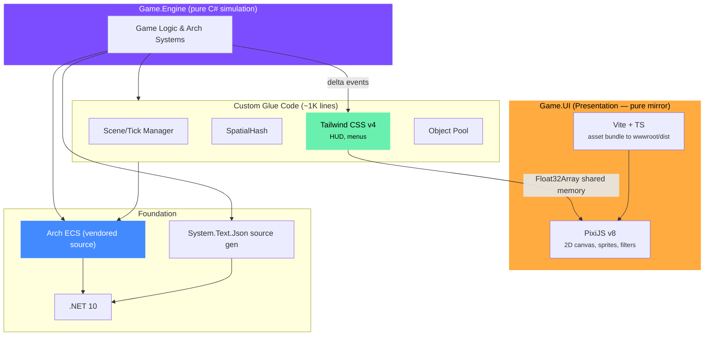

# E1 — Architecture Overview
> **Category:** Explanation · **Related:** [R1 Library Stack](../R/R1_library_stack.md) · [E2 Why Nez Was Dropped](./E2_nez_dropped.md) · [G1 Custom Code Recipes](../G/G1_custom_code_recipes.md)

---

## Core Philosophy: Composition, Not a Monolith

The single most important architectural decision: **do not depend on a monolith game framework**. When a monolith's sole maintainer leaves, everything dies at once (see [E2](./E2_nez_dropped.md) for the lesson that shaped this choice).

The correct architecture is a **composed stack of focused, independently swappable pieces**: a pure C# simulation (Arch ECS, vendored as source you own) plus a web-aligned presentation layer (PixiJS + Tailwind + TypeScript). If one piece dies, you swap that one piece — not your entire game's foundation.

---

## One Entity Model: Arch ECS for Everything

Arch ECS handles **both** mass entities (bullets, particles, swarms) **and** unique entities (player, NPCs, bosses). There is no need for a separate Entity-Component system.

A player is just an entity with a `PlayerTag` component. A `PlayerMovementSystem` that queries for `PlayerTag + Position + Velocity` is equivalent to a behavioral `PlayerMovementComponent.Update()` method, but with better cache coherence and testability.

**Benefits of one entity model:**
- No bridge code between two entity systems
- No mental context-switching between EC and ECS paradigms
- One query language for spatial lookups, collision, AI decisions
- Simpler serialization (Arch.Persistence handles the whole world)

### Arch Packages (vendored as source, not NuGet)

Arch lives under `src/Arch/` (vendored source, `net10.0`, T4 templates) and is linked into `Game.Engine` via `ProjectReference`. Source generation is wired through `src/Arch.Generators/` (a `netstandard2.0` Roslyn analyzer pack referenced as `OutputItemType="Analyzer"`). Do **not** `dotnet add package Arch` — pull upstream into `src/Arch/` to update.

```
src/Arch            -- Core ECS, systems, event bus, persistence, relationships (vendored)
src/Arch.Generators -- Arch.System.SourceGenerator + Arch.AOT.SourceGenerator (analyzer)
```

### When Arch ECS Shines Most

| Scenario | Why Arch |
|----------|----------|
| Bullets, projectiles (hundreds+) | Cache-optimal iteration over flat arrays |
| Cellular automata / simulation grids | Bulk query operations |
| Particle systems (thousands) | Source-generated systems eliminate boilerplate |
| RTS units (hundreds of similar entities) | Spatial queries via archetypes |
| Vampire Survivors-style swarms | Command buffers for safe multithreaded spawning/despawning |
| Player, NPCs, bosses (unique entities) | `PlayerTag` component + dedicated systems — simple, testable |
| Inventory items as data | Arch.Relationships for entity-to-entity links |

---

## Architecture Stack



---

## The Composed Library Stack

Each library handles one concern and is independently swappable:

| Concern | Provider | Fallback if it dies |
|---------|----------|-------------------|
| Entity management | Arch ECS (vendored source) | Other C# ECS libs (DefaultECS, LeoECS) |
| 2D rendering | PixiJS v8 | Canvas2D fallback (slower) |
| UI | Tailwind CSS v4 | Raw HTML/CSS |
| Input | TypeScript DOM events → commands | Direct DOM listeners |
| Fonts | PixiJS Text + web fonts | CSS fonts |
| Sprites | Aseprite → PixiJS spritesheet (Vite) | Manual spritesheet parsing |
| Physics | Custom C# (no lib in stack) | Vendor a C# physics lib later |
| AI | BrainAI (optional, vendor as source) | Custom FSM/BT (~300 lines each) |
| Debug | Browser DevTools | Console logging |
| Coroutines | Ellpeck/Coroutine (optional) | Custom IEnumerator wrapper (~60 lines) |
| Serialization | System.Text.Json (built-in .NET) | Newtonsoft.Json (compatibility) |

**Full package list and install commands:** see [R1 Library Stack](../R/R1_library_stack.md).

---

## Custom Glue Code (~1,000 lines total)

Some things are better written yourself than taken from a library. The total custom code budget:

| Module | Lines | Time |
|--------|-------|------|
| Scene manager | ~150 | 2 hours |
| Render layer system | ~200 | 3 hours |
| SpatialHash broadphase | ~80 | 1 hour |
| Collision shapes (AABB, circle, polygon) | ~150 | 2 hours |
| Tween system | ~100 | 1.5 hours |
| Screen transitions | ~100 | 1.5 hours |
| Post-processor pipeline | ~150 | 2 hours |
| Object pool | ~30 | 0.5 hours |
| Line renderer | ~50 | 1 hour |
| **Total** | **~1,010** | **~14.5 hours** |

Every line is code you own, understand, and can debug. Implementation details and starter code are in [G1 Custom Code Recipes](../G/G1_custom_code_recipes.md).

---

## What You Gain

1. **No frozen dependency risk** — Arch is vendored source you own; presentation libs (PixiJS/Tailwind) are independently swappable
2. **One entity model** — Arch ECS for everything, no bridge code
3. **Web-aligned stack** — `npm` for the frontend, `dotnet` for the simulation; `dotnet restore` + `npm ci` get you running
4. **Modern .NET compatibility** — nothing blocks .NET 10
5. **Better UI** — Tailwind CSS + TypeScript give accessible, responsive HTML/CSS HUD and menus
6. **Smaller attack surface** — ~1,000 lines of custom glue vs. ~50,000+ lines of a monolith framework
7. **Faster builds** — no compiling a massive framework submodule

---

## Cross-Platform Validation

This architecture targets the web via a single host:

| Platform | Host | Status |
|----------|------|--------|
| Web | `src/Game.Wasm` — .NET WASM host (non-Blazor) | Primary dev target |

The simulation (`Game.Engine`, the vast majority of code) requires **zero platform-specific changes**. The host is a thin bootstrapper that loads the same shared `Game.UI` library. ECS systems, simulation, and all game logic are shared. Zero-copy shared memory bridge (pinned `GCHandle` + `Float32Array` over WASM heap via `[JSImport]` notifyRender) pushes transform data to PixiJS without per-entity interop calls.

See [R3 Project Structure](../R/R3_project_structure.md) for the actual repo layout.
